## Software development
The degree of recommendation to use a particular method below depends on the ASIL (Automotive Safety Integrity Level):
- "++" indicates that the method is highly recommended for the identified ASIL
- "+" indicates that the method is recommended for the identified ASIL
- "o" indicates that the method has no recommendation for or against its usage for the identified ASIL

Prerequisites and output documents for each phase can be viewed in Annex A ISO 26262-6 2011

## Guidelines for ASIL D Software Development
The list below are requirements for ASIL D software design:
  - Dependent failure analysis, FMEA and/or FTA
  - Range check of in/outputs
  - Control flow monitoring + external monitoring
  - Redundancy required
  - Design verification: reviews, simulation, analysis
  - Design rules: MISRA C
  - Static code coverage
  - Code review & Unit testing
  - Requirement testing
  - Fault injection
  - Analysis: function & call coverage

### Phase 1: Initiation of product development at the software level
This is a planning activity where development sub phases and their supporting processes(ISO26262-8, ISO26262-9) are determined. The subphases nd processes are initiated by determining the appropriate methods to comply with the safety requirements and respective ASIL. 

A reference software development phase model is shown below. The specific clauses of each part of ISO 26262 is indicated by m-n where m is the number of the 
part and n is the number of the clause.
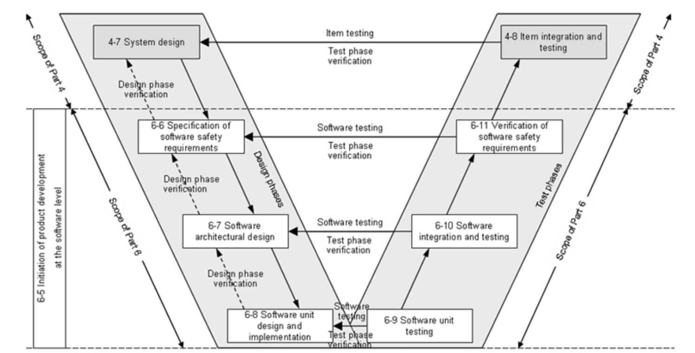

To support the correctness of the deisgn and implementation, the following general modelling and coding guidelines shall be addressed. Specific guidelines shall be different for a specific item development. For example, MISRA C and MISRA AC AGC are coding guidelines for the 'C' language

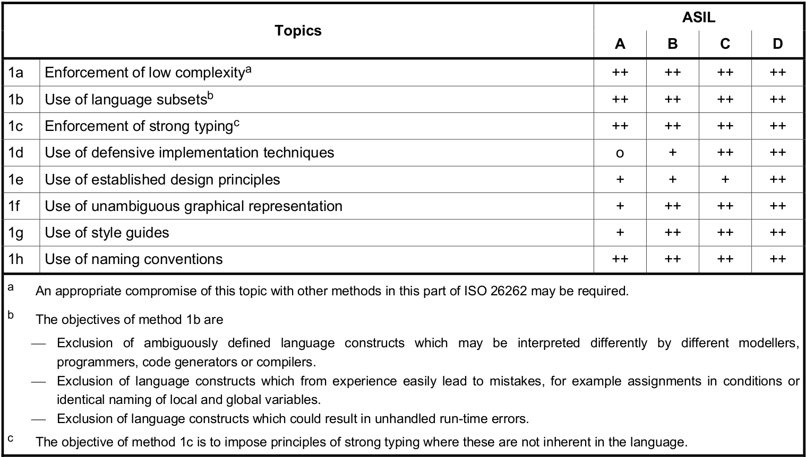

### Phase 2: Specification of software safety requirements
- Specify software safety requirements - This should address each software function whose failure could lead to the violation of a technical safety requirement
- Detail hardware-software interface requirements initiated in ISO 26262-4:2011, clause 7
- Verify that the above two are consistent with technical safety concept and system design specification

### Phase 3: Software Architectural design
- Develop an architectural design that realizes the software safety requirements - This shall exhibit *modularity*, *encapsulation* and *minimum complexity*.
- Verify this design

Principles for the software architectural design are shown below. An appropriate compromie between the methods can be necessary.
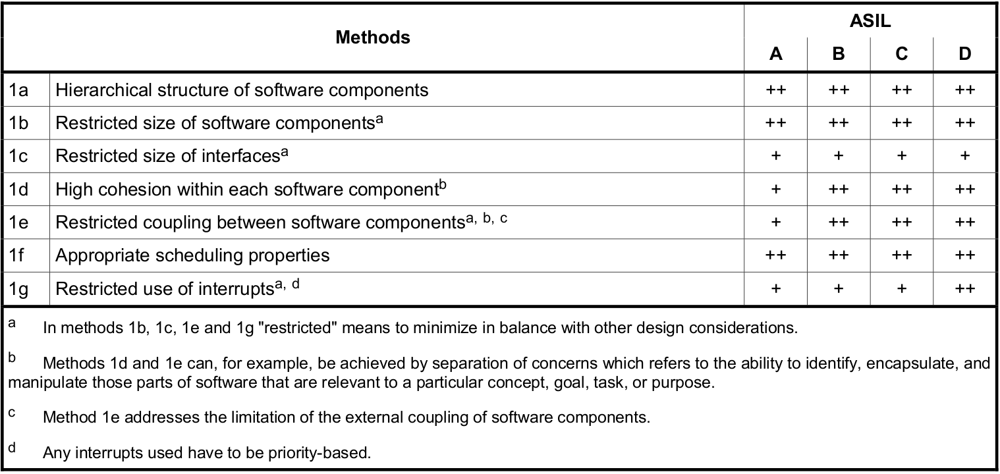

The following mechanisms for error detection shall be applied:
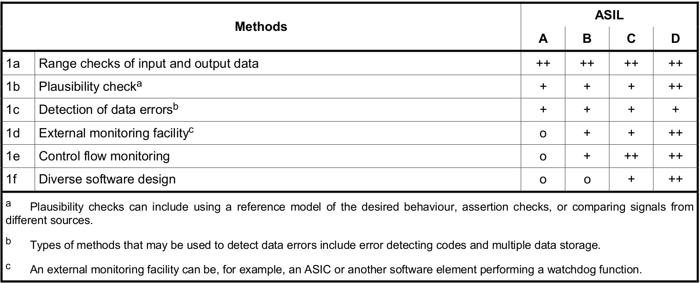

The following mechanisms for error handling shall be applied:
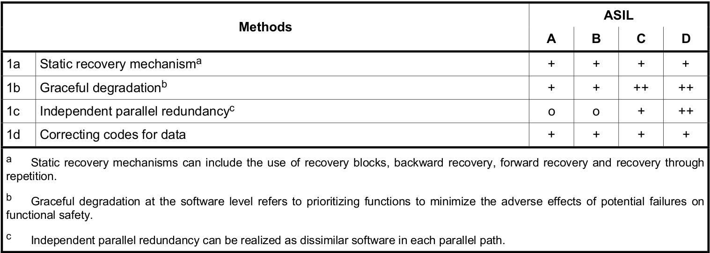

The following methods for architecture verification shall be applied:
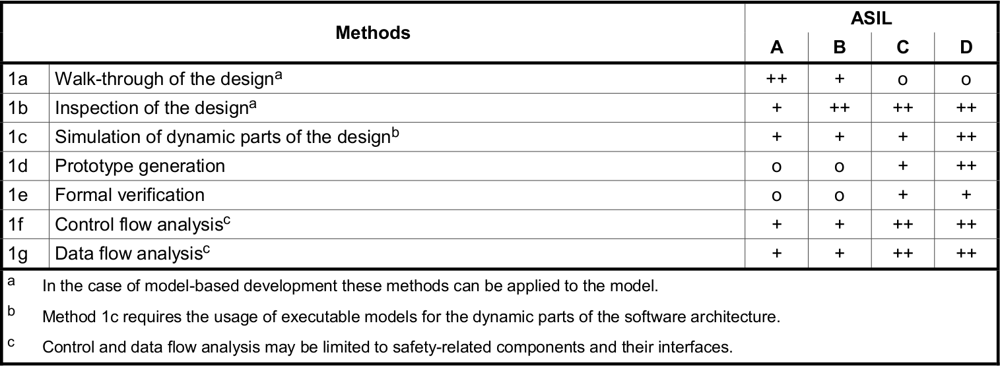

Note: For configurable software, recommendations in Annex C in ISO 26262-6 2011 shall be applied. Not sure if this applies to us.

### Phase 4: Software unit design and implementation
- Specify software units in accordance wit the software architectural design
- Implement the software units
- Static verification of the design and implementation of the software units- The design must achieve *avoidance of unnecessary complexity*, *testability* and *maintainability*.

Following are the design principles for the unit design and implementation. Specific guideleines that cover these in detail can be used. For the C language MISRA C covers many of these methods.
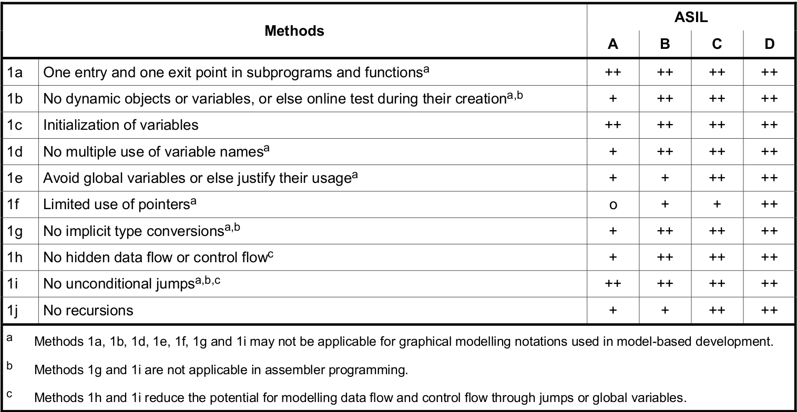

The following static verification methods shall be used. Dynamic testing will be covered in the next phase.
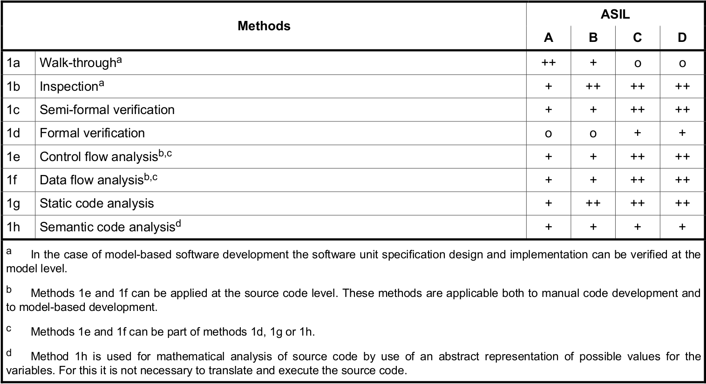

### Phase 5: Software unit testing
Demonstrate that all software units fulfill the design specifications 

The following unit tests shall be applied:
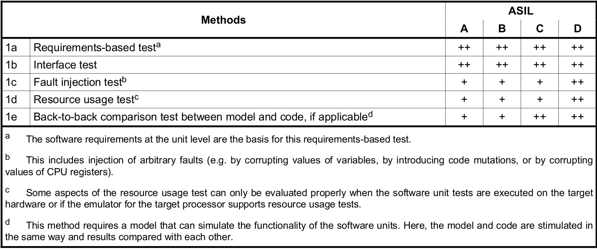

To evaluate completeness of the test cases, coverage of requirements at the software unit level shall be determined by the following metrics:
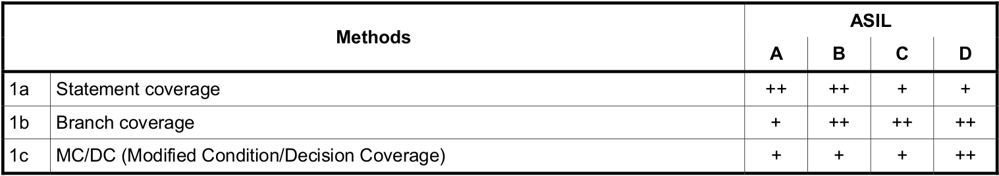

### Phase 6: Software integation and testing
- Integrate the software units
- Demonstrate that te software architectural design in realized by the embedded software

The following integration tests shall be applied:
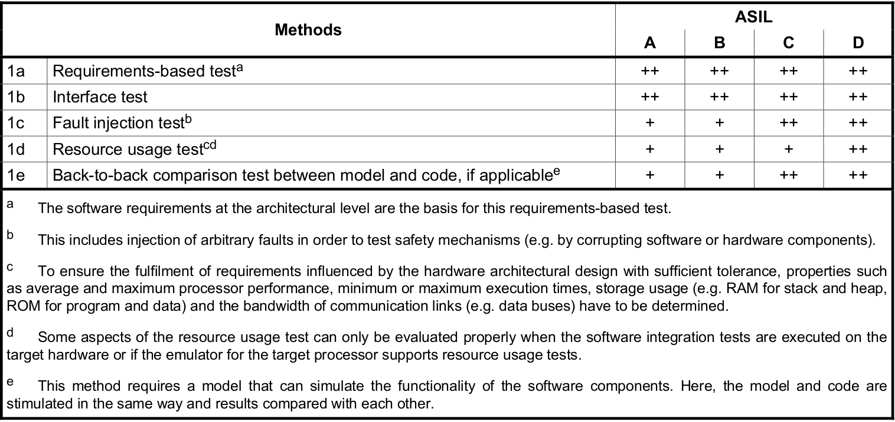

To evaluate completeness of the tests, coverage of requirements at the software architecture level shall be determined by the following metrics:
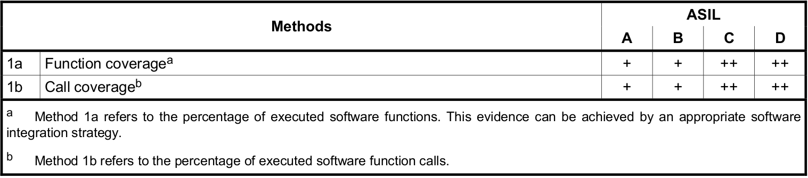

### Phase 7: Verification of software safety requirements
Demonstrate that the embedded software fulfills the software safety requirements

Tests shall be conducted in the test environments listed below:

## MISRA
- [misra c++ 2008 document](../misra/MISRA-Cpp-2008.pdf)
- [goanna misra c++ compliance matrix](../misra/misrac++2008-goanna.pdf)

## Tools
In order to be compliant with a standard, one has to use a tool that is certified to be used in the development for that standard. There isn'nt a single tool that will satisfy all clauses of ISO 26262. Any claims on 100% compliance must be examined carefully. Following are the six major areas that have to be covered by tools.

1. Project management - Requirements specification, Requirements verification
2. Design - Software architecture design, software design verification
3. Code - software unit design and implementation, software unit verification

Others:
- Hardware-software integration
- System test

Following are all the existing tools.

### 1. VectorCast
VectorCast tools for all phases of [verification](https://softwaretesting.vectorcast.com/acton/attachment/10305/f-004e/1/-/-/-/-/VectorCAST_ISO-26262.pdf). This includes VectorCast/C++, VectorCast/Cover, VectorCast/Lint

### 2. Klockwork
Klockwork has tools for design verification (partial - architecture visualization only) and code verification (partial - static analysis only). Price **US$25k** for a yearly license with unlimited lines of code

### 3. LDRA
LDRA has tools for all phases of verification. Standard license is perpetual with yearly maintenance fees (20% of license fees). Following are for a LAN license. Even though some tools below say Windows, I was told that they work on linux as well.

##### Integrated tool suite:  
1. LDRA Testbed® Static Analysis tool suite for C & C++ on Windows : Code Review (Programming Standards Checking) + Quality Review (Code Assessment Metrics) + Design Review (Data Flow Analysis, Code Documentation & Graphical Visualisation). First Floating Licence **US$12k**, 2-5 Floating Licences (each) **US$6.7k**, Subsequent Floating Licences (each) **US4.9k**
2. LDRA Testbed® Static & Dynamic Analysis tool suite for C & C++ on Windows: All the above + Test Verification (Statement, Branch/Decision, Test Path & Procedure/Function Call Code Coverage Metrics). First Floating Licence **US$13.6k**, 2-5 Floating Licences (each) **US$8.2k**, Subsequent Users (each) **US$6k**.
3. LDRA Testbed® & TBrun® Static & Dynamic Analysis + Unit Test tool suite package for C & C++ on Windows: All the above + Unit & Integration Testing (automatic test harness generation, automatic test stub generation and test documentation reporting). First Floating Licence **US$18k**, 2-5 Floating Licences (each) 12.7k, Subsequent Floating Licences (each) **US$9.4k**.

##### Standalone tools
- LDRAcover™ for C & C++ on Windows: provides source code coverage analysis (Statement, Branch/Decision, Procedure/Function Call Code Coverage Metrics; GUI & CLI modes). Floating Licences (each) **US$7.9k**.
- LDRArules™ for C & C++ on Windows: Automated programming rules compliance checking and reporting. Select from a library of rules or create your own. Simple.  GUI & CLI modes included. Floating Licences (each) **US$4.9k**.
- LDRAunit™ for C & C++ on Windows: Unit & Integration Testing (automatic test harness generation, automatic test stub generation and test documentation reporting); Test Verification (Statement, Branch/Decision, Test Path & Procedure/Function Call Code Coverage Metrics), Documentation & Graphical Visualisation including Complexity Metrics.  GUI & CLI modes included. Floating Licences (each) **US$9k**.

##### Options
- TBmisra: LDRA Testbed Static Analysis tool needs Integrated tool suite 1 as a minimum prerequisite. TBmisra® adds the following internationally recognised, regulatory authority Programming Standards to the default LDRA Testbed® coding rules checking: MISRA-C:1998, MISRA-C:2004, MISRA C:2012,  MISRA C++:2008, JSF++ AV, HIC++, DERA & SEC-C. First Floating Licence **US$2.3k**, 2-5 Floating Licences (each) **US$1.9k**, Subsequent Floating Licences (each) **US$1.5k**
- TBeXtreme: The LDRA Testbed® & TBrun® tool suite needs Integrated tool suite 3 as a minimum prerequisite. TBeXtreme® testing provides automatic test case generation from source code analysis only to accelerate unit testing productivity. First Floating Licence **US$2.3k**, 2-5 Floating Licences (each) **US$1.9k**, Subsequent Floating Licences (each) **US$1.5k**
- TBmanager: Compliance Workflow Manager for Project Set-up, User Roles, User Collaboration, Verification Management, Verification Independence Management. First Floating Licence **US$3.8k**, 2-5 Floating Licences (each) **US$3.8k**, Subsequent Floating Licences (each) **US$3.8k**.
- TBreq & TBmanager Bundle: Needs Integrated tool suite 2 as a minimum prerequisite. TBreq interfaces directly with requirements management tools such as DOORS, RequisitePro, Word or Excel in order to ensure traceability across the software lifecycle and verification of the completeness of the requirements coverage. TBmanager supports TBreq with the allocation of requirements across project teams, mapping requirements directly into the source code, creating and managing verification tasks and then launching into the execution of these tasks using LDRA Testbed or TBrun. First Floating Licence **US$6.8k**, 2-5 Floating Licences (each) **US$4.5k**, Subsequent Floating Licences (each) **US$4.5k**.
- TBmisra® for LDRArules for C & C++ on Windows: LDRArules is a minimum prerequisite. TBmisra adds the following internationally recognised, regulatory authority Programming Standards to the default LDRA Testbed coding rules checking: MISRA-C:1998, MISRA-C:2004, MISRA C:2012, MISRA C++:2008, JSF++ AV, HIC++, DERA & SEC-C. Floating Licences (each) **US$1.5k**.
- TBeXtreme® for LDRAunit™ for C & C++ on Windows: TBeXtreme testing provides automatic test case generation from source code analysis only to accelerate unit testing productivity. Floating Licences (each) **US$1.5k**.
- Target Licence Package for Target Testing: The Target Licence Package (TLP) provides the right to use, and receive remote support (e-mail, phone, web-based) for, the LDRA tool suite for target environment testing (simulator or target CPU). Price per target environment to be supported. Cost per TLP **US$5.3k**.

### 4. Coverity
Coverity has tools for safety requirements verification (partial - set specific policies only), design verification (partial - architecture visualization only) and code verification (partial - static analysis only). Price 7 cents per line of code (LOC).

### 5. Programming research QA C++: 
Code verification (static analysis) with 92% automated MISRA rule enforcement. They claim this is the industry highest in automated MISRA testing and 100% is not possible.

The following supports 5 developers in different regions with non concurrent access - remote access from one location
- QA C++ Single floating WAN, license - US$29,750
- MISRA C++ Compliance Module         - US$5,950
- Annual Support and Maintenance      - US$7,140

The following supports 5 developers each in two regions with non concurrent access - LAN only
- 2 * QA C++ floating LAN, licenses   - US$31,000
- MISRA C++ Compliance Module         - US$6,200
- Annual Support and Maintenance      - US$7,440

 
### 6. IKV Medini Analyze
Medini Analyze comprises of numerous tools that can be used in the verification process

### 7. Parasoft 
Parasoft has tools for unit verification(static analysis, unit test and run time error checking)

### 8. Green hills MULTI
MULTI is a static analysis tool.

$ 5,900 for a node-locked license, $ 6,900 for dongle-locked and $ 11,900 for single user floating. Additional you have 20% for the maintenance contract for one year.

### 9. Grammatech codesonar
Codesonar is a static code analysis tool

### 10. QA systems - Cantata
Cantata is a dynamic testing tool

### 11. Goanna
Goanna is a static analysis tool

### 12. IBM rationale
Rationale DOORS is a Requirements management tool. They also have tools for architecture design

### 13. Sparks Enterprise architect
Enterprise architect is an architecture design tool

### 14. PTC/MKS integrity
Tool for project management that includes requirements specification and traceability

### 15. Vector
CANape is used to calibrate and simultaneously acquire measurement signals from ECUs. 

CANoe is a complete development, test and analysis tool for ECUsSystem test : HILS, simulation or physical testig environment especially regresstion testing

### 16. Arctic Core
Supports AUTOSAR development: http://www.arccore.com/products/arctic-core/standard-package.
- Developed in accordance with industry-acknowledged methodology as AutomotiveSpice, Misra and ISO26262.
- Test reports for each module available for quality assurance from automated testing at each product release.
- Developed according to the Autosar standard version 4.0.2, 4.0.3 and 4.1.1
- Fully supports all Implementation Conformance Classes ICC1 to ICC3 and provided  with full access to source code.
- Checked according to MISRA C:2004 (MISRA C2) and MISRA C:2012 (MISRA C3) – exceptions documented directly in the source code.
- Developed under software development processes in accordance with AutomotiveSpice assessed level 3.
- Provided with full Quality Metrics reports including Complexity level indicator based on McCabes Cyclomatic Complexity
- Code coverage reports available
- Access to tracing of requirements from Autosar directly into the source code in implementation as well as test.
- Os scalability class 1 and 3.
